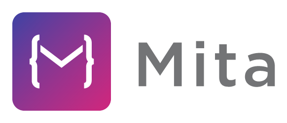

Eclipse Mita is a new programming language for the embedded IoT.
It targets developers who are new to embedded software development, specifically those who come from a cloud background.
As a developer Mita feels like a modern programming language (in the vein of TypeScript), but translates to C code which compiles to native code running directly on the embedded hardware.
Combining declarative configuration, powerful language features with code generation enables projects to scale their deployment over quantity - from the first prototype to shipping thousands of devices.

## Getting started
Mita serves two separate user groups: IoT developers and device vendors/platform integrators.

### Getting started as IoT developer
To get an impression of how Mita looks like for IoT developers, check out a [short quick demo](https://www.youtube.com/watch?v=Iv68Yc3u7i4), or a talk from the [Eclipse IoT Day 2018 in Grenoble](https://gricad.univ-grenoble-alpes.fr/video/eclipse-pax-new-programming-language-embedded-iot).
As an IoT developer Mita is most useful to you if it comes integrated in a device vendors offering. See below for a list of vendors who currently offer Mita support (if your organization/offering/platform should be in this list, please raise a pull-request):
* [Bosch Cross Domain Development Kit (XDK110)](http://xdk.io) ships Mita in its workbench

More information about the language itself can be found in our [documentation](https://www.eclipse.org/mita/).

### Getting started as a device vendor/platform integrator
For Mita to run on a platform/device there is some integration work necessary. Have a look at our [platform integrators guide](https://www.eclipse.org/mita/platforms/integratorsguide/) for more details on how to enable Mita for your platform.

## Developer Resources
* [Contributing](contributing.md): Learn how to report bugs, setup your workspace and submit your changes.
* [Quality Guidelines](quality_guidelines.md): Learn how to write good commits and pull requests.

## Get in Touch
Come and find us in our [Mattermost channel at eclipse.org](https://mattermost.eclipse.org/eclipse/channels/mita) or
check out the [Eclipse Mita project home page](https://www.eclipse.org/mita) for details regarding our mailing list. We also hold bi-weekly meetings at 2:00 PM GMT+1 [here](https://eclipse.zoom.us/j/575700843) starting from Nov 13, 2018.
