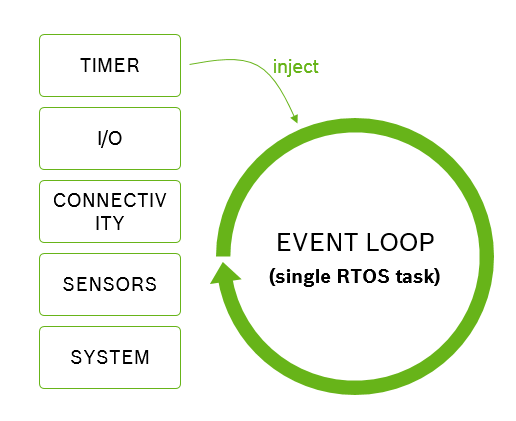

## Platform

Platforms describe the thing that you are writing software for; this thing is literally the piece of hardware and software platform running on it.
You do not have create that platform. 
Platforms consist of something you can configure (_configuration items_),
something you can read from at runtime (_modalities_), 
something you can send and receive data through (_signals_) 
and something you can react to (_events_).

 
Mita compiles to C code. There are a lot of specifics which we need to know so that we can generate code which runs on your embedded device.
The compiler needs to know how to start up the device, how to work with time, what components are available, what events they have, how to use and configure them.

Mita encapsulates all this information in what we call a _platform_. Platforms are provided by third parties (e.g. the vendor who built an embedded IoT development kit), not you the developer.
As part of that platform we get a _platform description_ and a bunch of _code generators_ capable of producing different aspects of the C code we generate.

In this section we will not go in detail on the generators, but talk about the _platform description_. The terminology introduced here matters to you as user of Mita.
We use it when talking about Mita programs, and subsequently throughout this documentation.


### System Resource
An IoT platform consists of many different components.
It will have some form of connectivity (think WiFi, LoRa or Bluetooth),
a bunch of sensors such as an accelerometer or temperature sensor,
and maybe some low-level input/output like [general-purpose IO](https://en.wikipedia.org/wiki/GPIO), [SPI](https://en.wikipedia.org/wiki/Serial_Peripheral_Interface_Bus) or [I2C](https://en.wikipedia.org/wiki/I2C).

In Mita we call those components system resources, as they are finite resources available to you as developer.
Some system resources can be instantiated multiple times (see the [setup section]()), others only exist once.
However, all system resources share the same features. They can be configured using _configuration-items_, can provide data at runtime using _modalities_, can offer means to communicate with the outside world using _signals_ and can provide _events_ for you to react to. 

### Configuration Items
Configuration items are the things of a system resource that can be configured.
For example, an acceleration sensor might have a range in which it is capable of operating. This range can be changed.
Or a light sensor might take some time to measure how much light is available - the more time spent measuring the better the measurement, but the longer it takes. This measurement time can be configured.
Configuration items all have a data type and are prescribed by the platform definition.

For example, the Bosch Cross Domain Development Kit ([XDK110 platform]()) supports a light sensor where one can configure the measurement time (they call it _integration time_):
```TypeScript
package main;
import platforms.xdk110;

setup light {
	integration_time = MS_200;
}
```

### Modalities
Modalities are things that can change at runtime, for example sensor values or the signal strength of a radio. Modalities are prescribed by the platform definition. You as developer do not have to set them up but they are simply available to you.
There is a read method defined for them which allows you to read the modality at any time. For example, take the light sensor of the ([XDK110 platform]()):
```TypeScript
package main;
import platforms.xdk110;

every 100 milliseconds {
	let lightLevel = light.intensity.read();
}
```

Modalities have special behavior when it comes to reading several of them at once. For example, a three-axis sensor will return values for all three axis in the same sample (think of a three-axis accelerometer). Thus when reading the x, y and z modalities one after the other, as developers we would expect them to come from the same sample: 
```TypeScript
package main;
import platforms.xdk110;

every 100 milliseconds {
	let x = accelerometer.x_axis.read();
	let y = accelerometer.y_axis.read();
	let z = accelerometer.z_axis.read();
	
	// x, y, z come from the same sample
}
```
The code generator that ships with the system resource (in this case the code generator provided by the [XDK110 platform]()) can choose to group modality access, so that the data read from them is coherent.

### Signals
Signals provide means to exchange data with the outside world. 
It depends on the system resource that defines the signal what is represented by that signal.
To understand what they are, let's look at a few examples of _signal instances_ first:

* Bluetooth Low Energy has GATT characteristics through which data is exchanged. In Mita, a GATT characteristic is a signal instance.
* REST-style APIs talk about resources on which one perform actions (e.g. read or write). In Mita such a resource is a signal instance.
* MQTT publishes messages to specific topics. In Mita a particular MQTT topic is a signal instance that one can publish and subscribe to.
* In I2C buses communication is centered around registers which can be read or written to. In Mita an I2C register is a signal instance.
* General purpose IO enables users to configure the hardware pins to specific behavior. In Mita a particular GPIO pin is a signal instance.
 
As developers we configure those signal instances within the setup block of a system resource. For example:
```TypeScript
package main;
import platforms.xdk110;

setup backend : HttpRestClient {
	var temperature = resource(endpoint="/temperature", writeMethod=PUT);
}

```

What is a signal then? A signal is the "prototype" of a signal instance.
It's the thing provided by the platform specification that prescribes that the `HttpRestClient` has a `resource`.

## Event Loop

All events that your program handles, thus all code that your program consists off, is executed sequentally by the event loop.
This eases code generation and prevents concurrency issues. It also means there is no concurrency at all, thus you get no timing
guarantees and long running operations can block all your code.


Mita is an event based language, because this programming style maps well to how IoT devices work. Most of the time an IoT device is sleeping to conserve energy.
Every now and then it will wake up, either based on time or some external event, do some measurement, computation and communication, and go back to sleep.
Mita lets you write programs that match this pattern well by reacting to events. 



All events that happen on the system are placed in the _event loop_ and handled sequentially.
This strategy has two main advantages.
Firstly, all code runs in a well defined context, namely the event loop task, as compared to some executing in an interrupt service routine context, some in a timer context and some in a task context. This makes it easier to generate predictable code. 
Secondly, we do not have to worry about concurrency (yet). All code runs sequentually, there simply is no concurrency we would have to worry about.

However, it also suffers from two major drawbacks: no timing guarantees and no concurrency.
As developers we do not get guarantees how long it will take between an event happening and our code reacting to it.
If, for example, a previous event handler is "running late", we might react to the event far too late.
Also, all our code running sequentally is a blessing (see above) and a curse. It means that while a long-running operation is on-going our whole program has to wait for that operation to complete.
For example, making an HTTP request over a slow network can take a long time, all the while our device will be dead waiting for that event to complete.

Future versions of Mita will address these issues and allow for some forms of concurrency. 

## Element Size Inference

Mita allocates all memory on the stack, there is no `malloc` or `free`. To do this we need to know at compile time how much memory
we need for things. Developers (most of the time) do not have to tell us how much memory is required, we infer it using _element size inference_.


Mita allocates all memory on the stack, there is no `malloc` or `free`.
This makes the memory use of our programs more predictable and easier to debug (free'ing some memory you're still using is a really bad idea).
It also means that, at compile time, we have to know how much memory we need. In C you, the developer, have to tell the compiler. In Mita we try to infer
that from your code. This way you do not have tell us how much space your string needs, or how big that array literal is. For example:
```TypeScript
fn main() {
	var message = "{ \"sensor\": \"";
	if(isAccelerometerActive()) {
		message += "accel";
	} else {
		message += "gyro";
	}
	message += `", "value": ${getSensorValue()} }`;
	
	println(message);
}
```
Notice how we never had to say how big message is or will become. Towards the end we even append some interpolated string and the compiler is still able to infer the worst-case size of the string.

We also use this feature to do many checks at compile time. For example, if we can infer the size of your array and the position you're trying access at compile time,
we can tell you if that access will work out or not; before you run your code.
