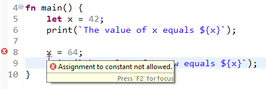

## Variables
By default, variables in Mita are immutable, which helps us optimize the generated code.
However, you can always choose to make variables mutable if you need it.
When a variable is immutable, its value has to be set during declaration and cannot be changed afterwards. 
The following code snippet illustrates the idea (we've omitted the package and import statements for brevity):

```TypeScript
fn main() {
	let x = 42;
	println(`The value of x is ${x}`);
	
	x = 64;
	println(`The value of x is now ${x}`);
}
```

When you save this code, you will see an error message `Assignment to constant not allowed.` at the `x = 64` statement.
That's the compiler enforcing the immutability of `x`.



To make variables mutable, use the `var` keyword. Then, you can re-assign a value to the variable after it was declared. 
For example

```TypeScript
var x = 42;
x = 64;
```

does not produce any compiler errors, unlike the example above. Because we wrote `var` instead of `let`, `x` became mutable and thus could be re-assigned to a different value.


Using mutable variables instead of immutable ones can lead to less efficient code being generated.
Thus, as a rule of thumb use immutable variables where you can.


### Types and Type Inference
Until now we have never had to write the type of the variables we declared.
Mita supports _type inference_ so that you, the developer, does not have to tell the compiler things it already knows.
However, there are times when we are unable to infer the type of a variable, for example when it is not initialized, or the compiler gets the type wrong.
In those cases you can explicitly tell the compiler what type a variable should have. For example:

```TypeScript
let x : uint8 = 20; 	// x is forced to be uint8, compared to the otherwise inferred int32 
var y : int16;		// y does not have an explicit initialization, so we need to explicitly denote the type.
```

This syntax for specifying types is consistent throughout the language. You can use it to specify the types of function parameters, the return type of a function or the types of structure members.

### Scoping and Shadowing

In Mita variables are block scoped and there is no shadowing within the same block. This is unlike languages like Rust or Haskell, for example, where one would be able to re-use the same name in multiple variable declarations.
The following is not legal Mita code, the compiler will complain that it `Cannot redeclare variable 'x'`.

```TypeScript
fn main() {
	let x = 42;
	let x = x * 2;		// Compiler error: Cannot redeclare variable 'x'
	let x = x * 3;		// Compiler error: Cannot redeclare variable 'x'
}
```

However, in a new block one can shadow a variable declared outside that block. The following code, for example, works just fine as it takes the `x` declared outside the _if block_, multiplies it by two and stores it in a _new immutable variable_ also named x.

```TypeScript
fn main() {
	let x = 42;
	
	if(true) {
		let x = x * 2;
		println(`x in block equals ${x}`);		// Output: x in block equals 84
	}
	
	println(`x outside block equals ${x}`);		// Output: x outside block equals 42
}
```


## Primitive Data Types
[Previously](#types-and-type-inference) we have seen that Mita is a statically typed language, meaning that every expression in Mita has a data type, fixed at compile time.
We distinguish between primitive and complex data types. Primitive data types consist of a single value, such as a number or a flag (other [languages](https://doc.rust-lang.org/book/second-edition/ch03-02-data-types.html) call those _scalar data types_).
Mita has three groups of primitive data types: integer, float and boolean. 

### Integer
An integer is a "whole number", i.e. one without a fraction. We already used integers in the previous section, specifically the `uint8` and `int16` types.
All integer types prefixed with a `u` are _unsigned_ types, meaning that they store positive values only but have a wider range than their signed counterparts.
The number at the end of the type indicates their _width_ in bits, that is how large a number they can store.

  Width | Signed | Unsigned  
--------|--------|-----------
  8 bit | `int8` | `uint8`   
 16 bit | `int16` | `uint16`
 32 bit | `int32` | `uint32`
 
Each signed type can store values from -2<sup>(n-1)</sup> to 2<sup>(n-1)</sup> - 1, unsigned types can store values ranging from 0 to 2<sup>n</sup> - 1, where `n` is the width of the data type. For example, `uint8` can store integers up to 2<sup>8</sup>-1 = 255.

You can write integer literals either in decimal form (e.g. `42`) or in hexadecimal form (`0xFF`). If you don't specify a type explicitly the compiler will infer the concrete data type based on first use. For example:

```TypeScript
fn addOne(x : int16) {
	return x + 1;
}

fn main() {
	let y = addOne(42); // 42 is infered as int16
}
```

### Floating Point
Mita supports a 32 bit wide single precision `float` datatype and a 64 bit wide double precision `double` floating point number type.
By default floating point literals (e.g. `1.0`) are inferred as single precision `float`.

### Boolean
Like in most other programming languages Mita supports a boolean type with two possible values: `true` and `false`. The boolean type in Mita is called `bool`. For example:

```TypeScript
fn main() {
	let isTrue = true;
	let falseByDefault : bool; // with explicit type, bool defaults to false.
	
	if(isTrue) {
		println("It is true!");
	}
}
```

### Operations on Primitive Types
Mita supports a range of operations on primitive values. These operations are supported on operands of the same type, or compatible smaller types (e.g. `int32 + int16`). No worries though, the compiler will tell you what's allowed and what isn't.

* multiplication: ```*```
* addition: ```+```
* subtraction: ```-```
* division: ```/```
* bit-wise negation: ```~```
* bit-shift left: ```<<```
* bit-shift right: ```>>```
* logical negation (bool only): ```!```

### Complex Types
Complex data types (such as strings or structures) need more elaboration than a single section could encompass. Head over to the [types section]() to find out more.

## Control Structures
Code can branch using if statements

```TypeScript
let foo = 10;
if(foo >= 15) {
    println("That's high");
} else if(foo >= 10) {
    println("That's less high");
} else {
    println("That's not high");
}
```

If-conditions must be boolean

```TypeScript
if(foo) { } /* compiler error: Incompatible types int32 and boolean. */
```

Curly brackets for blocks are required

```TypeScript
if(true) printf("Foo"); /* syntax error: Missing { */
```

Traditional for loops are supported

```TypeScript
for(var i = 0; i < 10; i++) { }
```

Traditional while loops are supported

```TypeScript
while(true) { }
```

Do-while loops are supported

```TypeScript
do { } while(true)
```

