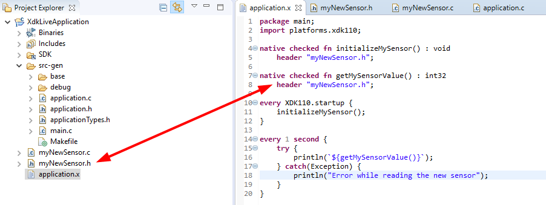

Mita transpiles to C code, i.e. the compiler produces C code rather than a binary executable.
This begs the question if we can call existing C code from within Mita programs.
Such integration of the "target language" is referred to as _foreign function interface_ (or _FFI_ in short) because the functions we wish to call from within Mita are defined in a foreign language: C.
Other languages sport similar concepts, for example _TypeScript_ supports [declarations](https://basarat.gitbooks.io/typescript/docs/types/ambient/d.ts.html) which allow you to use code written in JavaScript (the language TypeScript compiles to).

Calling native C functions is useful if we want to re-use existing libraries, or for the things which are easier to express in C than they are to express in Mita.
Suppose you wanted to connect a new sensor to your device and the sensor came with a driver library written in C.
Using the foreign function interface you can integrate and use that driver library from within Mita.

## Native Functions
To make a function written in native C known to Mita you have to declare them in an Mita file, e.g.:
```TypeScript
native unchecked fn abs(n : int32) : int32
	header "math.h";
```

The header which we have named during the declaration of the native function will be automatically included in the generated C code where necessary.
With the `abs` function declared like that we can use it just like a regular Mita function.

```TypeScript
package main;
import platforms.xdk110;

every 1 second {
	let xAxisAcceleration = acc
	println(`Absolute X axis acceleration: ${abs(accelerometer.x_axis.read())}`);
}
```

## Unchecked vs Checked
Notice the `unchecked` keyword in the example above.
Mita supports exceptions which map to special return values in the generated C code.
The `unchecked` keyword and its counterpart `checked` tell the compiler if it should use the Mita calling convention which handles exceptions, or the C calling convention where the return value is not used for exceptions.

Let's look at both calling conventions in detail. For both calling conventions we will see the Mita declaration and the corresponding C header that the compiler expects.

### Unchecked
```TypeScript
native unchecked fn foobar(n : int32) : int32
	header "unfoobar.h";
	
native unchecked fn foobarWithRef(ref : &int32) : int32
	header "unfoobar.h";
	
native unchecked fn foobarVoid(n : int32) : void
	header "unfoobar.h";
```
expects `unfoobar.h` to look something like
```C
#include <stdint.h>

int32_t foobar(int32_t n);

int32_t foobarWithRef(int32_t* ref);

void foobarVoid(int32_t n);
```

### Checked
```TypeScript
native checked fn foobar(n : int32) : int32
	header "foobar.h";
	
native checked fn foobarWithRef(ref : &int32) : int32
	header "foobar.h";
	
native checked fn foobarVoid(n : int32) : void
	header "unfoobar.h";
```
expects `foobar.h` to look something like
```C
#include <BCDS_Basics.h>
#include <BCDS_Retcode.h>
#include <stdint.h>

Retcode_T foobar(int32_t* result, int32_t n);

Retcode_T foobarWithRef(int32_t* result, int32_t* ref);

Retcode_T foobarVoid(void* result, int32_t* ref);
```

The `Retcode_T` and `BCDS_*` includes are specific to the [XDK110 platform]().
Other platforms will use a different type to express error codes.

## Custom C file include
The Makefile of an Mita project is automatically generated. The compiler will include all C files and header in your project in that
Makefile. This way you can mix C and Mita code within the same project.
For example you could have a custom header and corresponding implementation in your project, and an Mita file which declares them.



## Pitfalls
In order to support all features of Mita, we sometimes have to generate code which does not directly map to a "native C API".
Arrays are a good example: each array type in Mita gets its corresponding C type. For example `array<int32>` turns into an `array_int32` structure and not `int32_t[]` as one could expect.

Whenever you cannot import an existing API directly using `unchecked` native functions, you could write a wrapper in C using custom C file includes described above.
